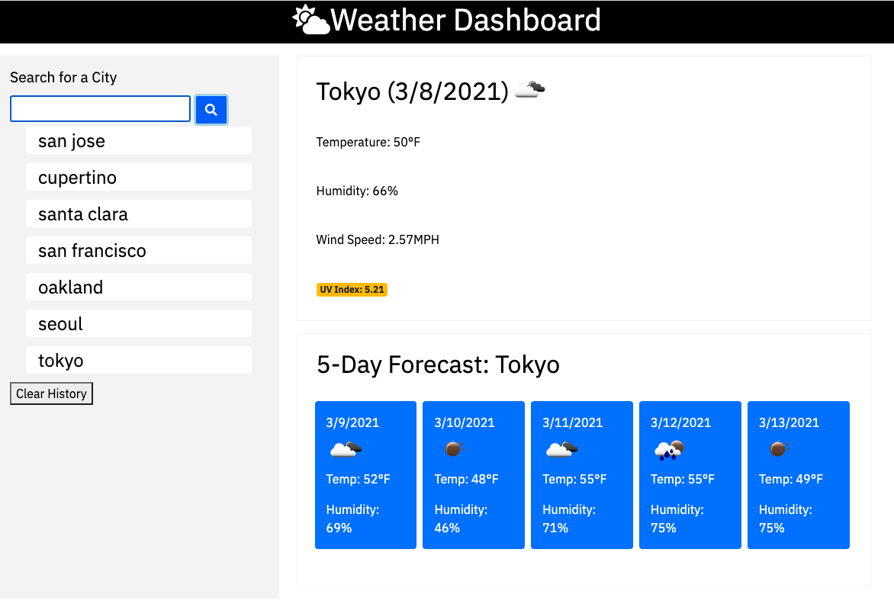
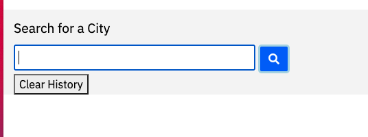
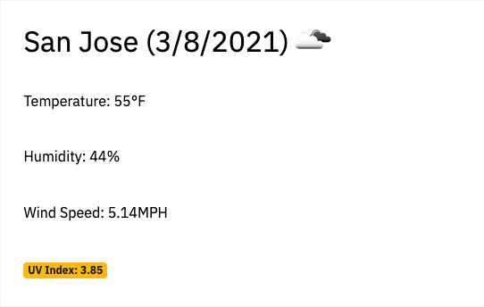
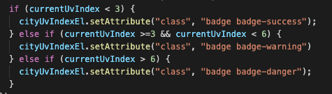
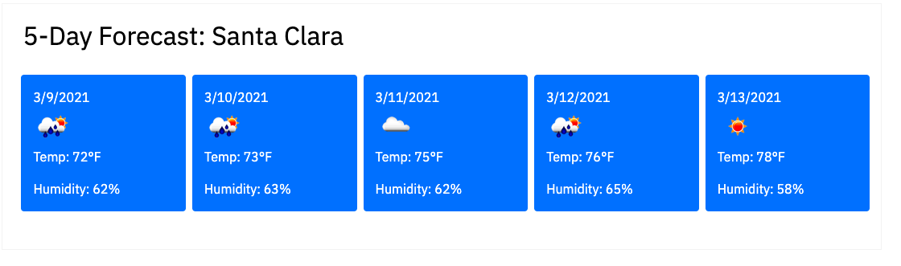
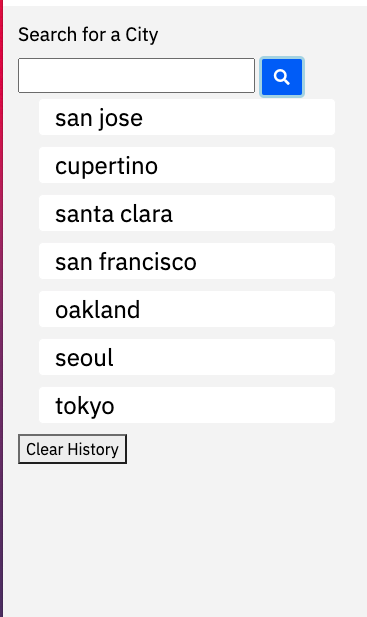
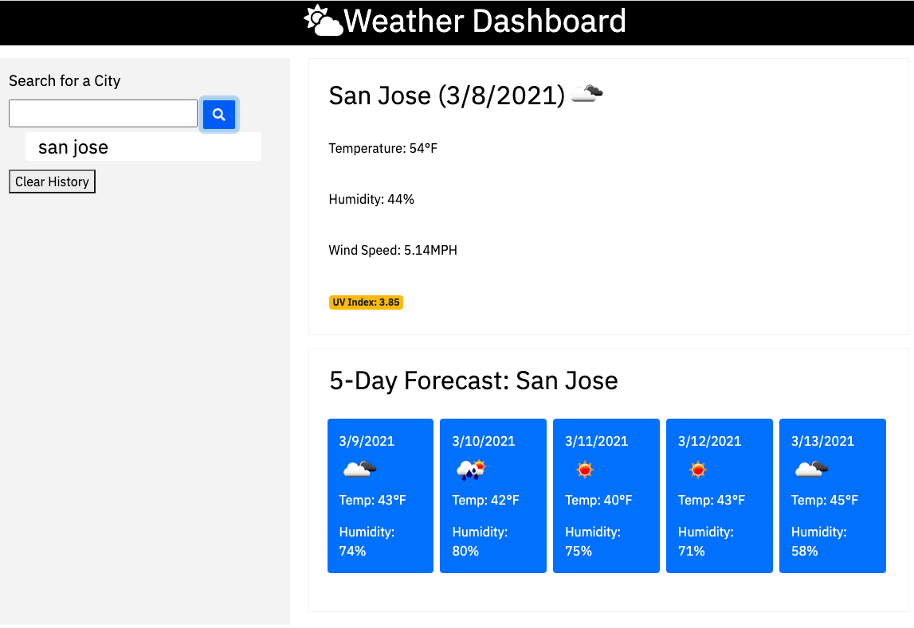

# Weather Dash-board

## Description 

Hi, 

No matter what you do, you need weather info.

You don't wanna ruin your plan bcuz of weather.
search where ever you are/will be to find our weather.

even serch it for the future reference.

## Table of Contents (Optional)

* [Installation](#installation)
* [Usage](#usage)
* [Technology](#technology)
* [Credits](#credits)
* [License](#license)

## Installation

- Please visit Website https://richardyjkim.github.io/weather-dashboard

## Usage 

- Introducing weather dash-bard, 
start manage your weather from today

- search your city

- it will tell your city (current date)
- it will tell you there temperature, humidity, and windspeed, and finally UV index

- UV index scale used in the United States conforms with international guidelines for UVI reporting established by the World Health Organization
- 1,2 = favorable
- 3~5 = moderate
- 6+ = very high

- wanna know next 5 day? here you are

- all your search result could be recall back
- dont wanna see em? clear it all and re searched em again.

- when you come back. we will present you what you have searched right before you left us.

## Technology
    -HTML
    -CSS
    -Java Script
    -Bootstrap

## Credits

 - Richard Kim: richardyjkim (github)
 - https://openweathermap.org/current (API)
 - https://fontawesome.com/ (font)

## License

MIT License

Copyright (c) [2021] [Richard Y Kim]

Permission is hereby granted, free of charge, to any person obtaining a copy
of this software and associated documentation files (the "Software"), to deal
in the Software without restriction, including without limitation the rights
to use, copy, modify, merge, publish, distribute, sublicense, and/or sell
copies of the Software, and to permit persons to whom the Software is
furnished to do so, subject to the following conditions:

The above copyright notice and this permission notice shall be included in all
copies or substantial portions of the Software.

THE SOFTWARE IS PROVIDED "AS IS", WITHOUT WARRANTY OF ANY KIND, EXPRESS OR
IMPLIED, INCLUDING BUT NOT LIMITED TO THE WARRANTIES OF MERCHANTABILITY,
FITNESS FOR A PARTICULAR PURPOSE AND NONINFRINGEMENT. IN NO EVENT SHALL THE
AUTHORS OR COPYRIGHT HOLDERS BE LIABLE FOR ANY CLAIM, DAMAGES OR OTHER
LIABILITY, WHETHER IN AN ACTION OF CONTRACT, TORT OR OTHERWISE, ARISING FROM,
OUT OF OR IN CONNECTION WITH THE SOFTWARE OR THE USE OR OTHER DEALINGS IN THE
SOFTWARE.

© 2021 Trilogy Education Services, LLC, a 2U, Inc. brand. Confidential and Proprietary. All Rights Reserved.
